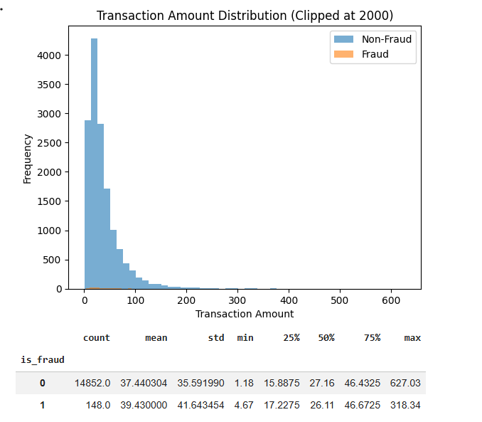
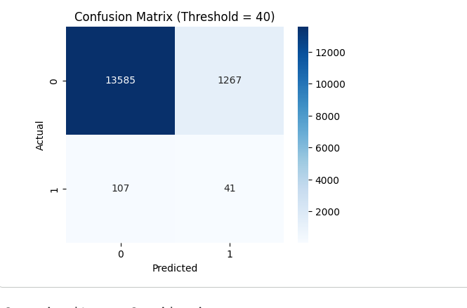

# Financial Transaction Fraud Risk Analysis

## Overview
This project simulates financial transaction data to analyze fraud patterns and evaluate a rule-based fraud risk scoring model. The objective is to demonstrate practical fraud analytics, model evaluation, and business tradeoff analysis.

---

## Business Problem
Financial institutions face ongoing fraud risk that can lead to:

- Direct financial losses  
- Regulatory penalties  
- Reputational damage  
- Customer experience friction  

This project explores how fraud detection thresholds impact operational outcomes.

---

## Dataset
Synthetic transaction dataset (15,000 records) including:

- Transaction amount
- Hour of transaction
- International indicator
- Card-present indicator
- Merchant risk score
- Account age
- Transaction count (24h)
- Fraud label (simulated)

Fraud rate: ~1% (realistic class imbalance)

---

## Methodology

### 1. Data Simulation
Generated synthetic financial transaction dataset with risk-weighted fraud probability.

### 2. Exploratory Data Analysis
- Class imbalance analysis
- Transaction amount distribution
- Fraud behavior comparison

### 3. Rule-Based Risk Scoring
Built an explainable scoring model using weighted risk indicators.

### 4. Threshold Analysis
Evaluated performance at multiple thresholds:
- Threshold 60 → High precision, low recall
- Threshold 40 → Higher recall, more false positives

### 5. Confusion Matrix Evaluation
Visualized model performance and analyzed:
- True Positives
- False Positives
- False Negatives

---

## Key Insights

- Fraud detection is a precision-recall tradeoff problem
- Lower thresholds increase fraud detection but increase customer friction
- Optimal threshold depends on risk tolerance and regulatory requirements
- Class imbalance significantly impacts fraud modeling performance

---

## Skills Demonstrated

- Python (Pandas, NumPy, Matplotlib, Seaborn)
- Feature engineering
- Rule-based modeling
- Threshold tuning
- Confusion matrix analysis
- Business interpretation of model results

---

## Ethical Considerations

Fraud detection systems must balance:
- Customer experience
- Regulatory compliance
- Financial risk exposure
- Fairness and bias considerations

---
## Visual Results

### Class Distribution

### Transaction Amount Distribution

### Confusion Matrix (Threshold = 40)

## Author
David Blakney  
Data Analytics | Fraud Risk | Business Intelligence

